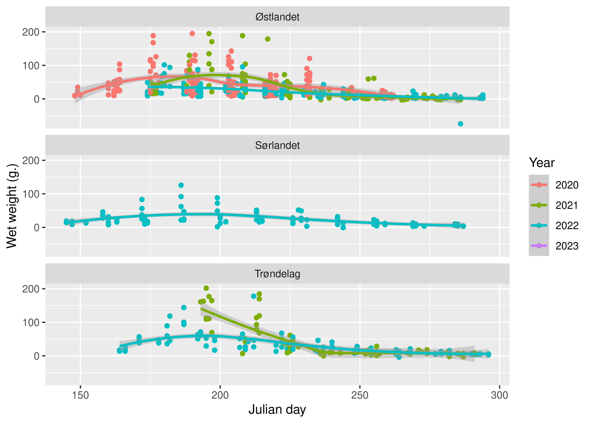
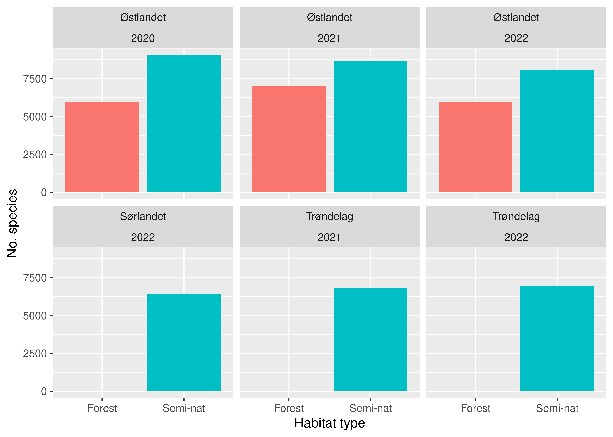

GBIF data export from the Norwegian insect monitoring program (NorIns)
================
Jens Åström
9/11/23

``` r
suppressPackageStartupMessages({
require(tidyverse)
require(NinaR) #optional
require(DBI)
require(RPostgres)
require(sf)
require(maps)
require(tidyjson)
require(xml2)
})
```

## Introduction

This script downloads observation records from the Norwegian insect
monitoring program (NorIns), and unpacks the data for further use. The
data is stored within GBIF, and the first section shows how to download
the data from there. The rest of the script deals with rearranging the
data from GBIFs eventCore standard, where several hierarchical levels is
compressed into a single event table. Portions of the script can be used
as an example for projects with other data formatting preferences. The
data is freely available, given that you site the source appropriately.
See “Citation and meta-data” below.

## Data structure

The data collection of the program has a hierarchical nature, where the
data from each respective level is originally stored as separate tables
in a database (normalised data). For the purpose of this GBIF dataset,
at the topmost level 4), we have a whole sampling season (april-october)
of each locality, where data associated with the entire locality-season
is stored, such as habitat qualities. At level 3), we have individual
sampling periods (of typically 2 weeks) of one or multiple traps within
the locality. This data includes e.g. time period and associated
weather. Each season can have up to 14 such sampling periods. At level
2), we have data from a single trap within a sampling period, such as
biomass and ethanol concentration. Lastly, at level 1, we have insect
identifications of each trap sample. Most samples only have 1
identification “event”, although multiple identification methods can be
employed some samples.

The hierarchical structure is handled within GBIF through the Darwin
Event Core-standard. Here, all the actual observation data of the
species are located in an “occurrence”-table, which is linked to an
“event”-table containing the information linked to the observation. The
event-table has to handle all the hierarchical levels mentioned above,
and thus combines data from many original tables. The hierarcical nature
of these tables are maintained through “parent-event”-keys, that relate
lower levels to their respective higher “parent” levels. By this design
of GBIF, you can have an arbitrary number of parent events (hierarchical
levels) within the same table, instead of normalizing the data across
several tables. The downside is that you need to keep track of the
eventID’s and the parentEventID’s to recreate the original data
structure.

## Finding the raw data and how to cite it

The dataset can be found at http://gbif.org by searching for “National
insect monitoring in Norway”. This will take you to the webpage of the
dataset:
https://www.gbif.org/dataset/19fe96b0-0cf3-4a2e-90a5-7c1c19ac94ee Here
you can access the meta-data of the dataset. This data is freely
available, but please cite the source. The citation is visible at the
dataset’s webpage at GBIF. The citation can be fetched programmatically
this way.

``` r
dataset_id <- "19fe96b0-0cf3-4a2e-90a5-7c1c19ac94ee" ##From the webpage URL
# Suggested citation: Take the citation as from downloaded from GBIF website, replace "via GBIF.org" by endpoint url. 
tmp <- tempfile()
download.file(paste0("http://api.gbif.org/v1/dataset/",dataset_id,"/document"),tmp) # get medatadata from gbif api
meta <- read_xml(tmp) %>% as_list() # create list from xml schema
gbif_citation <- meta$eml$additionalMetadata$metadata$gbif$citation[[1]] # extract citation
```

The citation to use is then:

- Åström J (2023). National insect monitoring in Norway. Version 1.9.
  Norwegian Institute for Nature Research. Sampling event dataset
  https://doi.org/10.15468/2jwnc6 accessed via GBIF.org on 2023-09-11.

## Fetching the raw-data from GBIF

We need an “endpoint_url” to retrieve the actual data set. This is found
at the bottom of the webpage for the dataset. This can also be found
programatically as shown here.

``` r
dataset_url <-  paste0("http://api.gbif.org/v1/dataset/",dataset_id,"/endpoint")
dataset <- RJSONIO::fromJSON(dataset_url)
endpoint_url <- dataset[[1]]$url # extracting URL from API call result
```

The endpoint for our dataset looks like this: (Also visible on the
webpage for the dataset)

- https://ipt.nina.no/archive.do?r=national_insect_monitoring

With the endpoint, we can download the data in a zipped format.

``` r
# Download from dwc-a from IPT  putting into data folder
system("mkdir -p GBIF_data")
download.file(endpoint_url, destfile = "GBIF_data/gbif_download.zip", mode="wb")
```

We unzip it in the same folder.

``` r
unzip("GBIF_data/gbif_download.zip",
      exdir = "GBIF_data")
```

### Read in the raw GBIF files

The data is a simple tab delimited text file.

``` r
event_raw <- read_delim("GBIF_data/event.txt", 
                       delim = "\t",
                       locale = locale(encoding = "UTF-8"),
                       progress = FALSE,
                       show_col_types = FALSE)
```

The occurrence data follows the same procedure.

``` r
occurrence_raw <- read_delim("GBIF_data/occurrence.txt", 
                       delim = "\t",
                       locale = locale(encoding = "UTF-8"),
                       progress = FALSE,
                       show_col_types = FALSE
                       )
```

## Unpacking the data from the GBIF raw format

As mentioned above, the GBIF eventCore dataformat is compact for
storage, but isn’t the most practical to use since all hierarchical
levels are stored in the same event table. The next step is therefore to
split out the separate levels from the combined event table. I will use
the original table names for each hierarchical level.

``` r
identifications_raw <- event_raw %>% 
  filter(samplingProtocol == "Level_1")

sampling_trap_raw <- event_raw %>% 
  filter(samplingProtocol == "Level_2")

locality_sampling_raw <- event_raw %>% 
  filter(samplingProtocol == "Level_3")

year_locality_raw <- event_raw %>% 
  filter(samplingProtocol == "Level_4")
```

### Extract the data that didn’t fit into the GBIF standard

In all levels, we have information that don’t fit into the GBIF data
format. These are bundled together in to a JSON-string in a GBIF column
named “dynamicProperties”. We need to spread this content into separate
columns.

``` r
identifications_raw %>% 
  select(dynamicProperties) %>% 
  head(1)
```

    # A tibble: 1 × 1
      dynamicProperties                                                             
      <chr>                                                                         
    1 "{\"id\":\"cc5c4506-d23c-4db4-be1c-cc1318c63ec5\",\"identification_name\":\"m…

Here, we split out the json string (dynamicProperties) into a separate
table, and join it back to the original data afterwards. I tried various
json-packages earlier with limited success, but this works and should be
stable.

#### Identifications

To reiterate, this is the species identifications (metabarcoding
results) from each trap catch. As of now (2023), there is only 1 species
identification process per sample, but in principle there could be
multiple identifications, for example manual identification in addition
to metabarcoding, for some samples.

``` r
identifications <- identifications_raw %>% 
  #collect() %>% 
  select(-dynamicProperties)

tempDynamic <- identifications_raw %>% 
  #head() %>% 
  select(dyn = dynamicProperties) %>% 
  #collect() %>% 
  unlist() %>% 
  spread_all()  %>% 
  as_tibble() %>% 
  select(-document.id)


identifications <- identifications %>% 
  left_join(tempDynamic,
            by = c("id" = "id"))

if(!nrow(identifications) == nrow(identifications_raw) & nrow(identifications) == nrow(tempDynamic)) stop("Identification rows don't match!")
```

The new columns contain an identification method name, optional
identification comment, read_abundance (number of DNA-copies),
extraction date, extraction-kit, and optional extraction comment. Here
is a sample of the extracted columns, added to the rest of the data:

``` r
identifications %>% 
  select(identification_name,
         identification_comment,
         read_abundance,
         ekstraksjonsdato,
         ekstraksjonskit,
         ekstraksjonskommentar) %>% 
  head()
```

    # A tibble: 6 × 6
      identification_name   identification_comment read_abundance ekstraksjonsdato
      <chr>                 <lgl>                           <dbl> <lgl>           
    1 metabarcoding_novaseq NA                             556742 NA              
    2 metabarcoding_novaseq NA                             390776 NA              
    3 metabarcoding_novaseq NA                             249041 NA              
    4 metabarcoding_myseq   NA                              31057 NA              
    5 metabarcoding_myseq   NA                              83008 NA              
    6 metabarcoding_novaseq NA                            3557357 NA              
    # ℹ 2 more variables: ekstraksjonskit <lgl>, ekstraksjonskommentar <lgl>

We can also remove some darwinCore-columns that are not relevant for
this level, such that we end up with a more compact table. We also
rename the parentEventID column to make further joins more intuitive,
and adopt a snake case naming standard, which is good practice when
working with databases (esp. PostgreSQL).

``` r
identifications <- identifications %>% 
  select(identification_id = eventID,
         sampling_trap_id = parentEventID,
         identification_name,
         identification_comment,
         read_abundance,
         ekstraksjonsdato,
         ekstraksjonskit,
         ekstraksjonskommentar)
```

#### Sampling trap

These are the data attributed to a single trap catch. The locationIDs
are not very human-readable, but we can extract the trap name from the
“locationRemarks” column.

``` r
sampling_trap <- sampling_trap_raw %>% 
  mutate(trap_name = stringr::str_split_i(locationRemarks, ": ", 2)) %>% 
  select(-dynamicProperties) 

tempDynamic <- sampling_trap_raw %>% 
  select(dyn = dynamicProperties) %>% 
  unlist() %>% 
  spread_all()  %>% 
  as_tibble() %>% 
  select(-document.id)


sampling_trap <- sampling_trap %>% 
  left_join(tempDynamic,
            by = c("id" = "id"))

if(!nrow(sampling_trap) == nrow(sampling_trap_raw) & nrow(sampling_trap) == nrow(tempDynamic)) stop("Sampling trap rows don't match!")
```

The new columns contain the trap type, trap model, preservation liquid
information, measured ethanol concentration at lab (after topping-up in
the field), and the biomass of the sample (as wet weight in grams). The
samples are weighed in the bottles (gross weight), after a standardized
draining of preservation liquid, and the bottle weights (calculated from
a sample of 10 empty similar bottles) are subtracted, to get the net wet
weight. For a few samples, especially in the starting year, the ethanol
measurement and/or sample weights are missing.

Here is a sample of the extracted columns, added to the rest of the
data:

``` r
sampling_trap %>% 
  select(trap_type,
         trap_model,
         liquid_name,
         ethanol_prc_at_lab,
         net_wet_weight) %>% 
  head()
```

    # A tibble: 6 × 5
      trap_type trap_model            liquid_name  ethanol_prc_at_lab net_wet_weight
      <chr>     <chr>                 <chr>                     <dbl>          <dbl>
    1 Window    Window_NMBU_2021      PropGl70_Et…               NA             3.49
    2 Window    Window_NMBU_2021      PropGl70_Et…               72.8           2.29
    3 Window    Window_NMBU_2021      PropGl70_Et…               55.0           7.68
    4 Malaise   Malaise_Watkins_Black EtOH96                     NA            NA   
    5 Window    Window_NMBU_2021      PropGl70_Et…               78            NA   
    6 Malaise   Malaise_Watkins_Black EtOH96                     92.5          38.3 

Lastly, we strip away some (for most people) superfluous columns.

``` r
sampling_trap <- sampling_trap %>% 
  select(sampling_trap_id = eventID,
         locality_sampling_id = parentEventID,
         trap_name,
         sample_size_value = sampleSizeValue,
         sample_size_unit = sampleSizeUnit,
         trap_type,
         trap_model,
         liquid_name,
         ethanol_prc_at_lab,
         net_wet_weight,
         point_latitude = decimalLatitude,
         point_longitude = decimalLongitude,
         point_wkt = footprintWKT,
         coord_unc_in_meters = coordinateUncertaintyInMeters,
         coordinate_system = geodeticDatum)
```

### Locality samplings

These are the data attributed to each locality sampling, meaning a
single sampling period in a single location, typically around 2 weeks.
The semi-natural sites typically have only 1 sampling trap per locality
sampling, but forest habitats have an additional 4 window traps within
each locality sampling, thus sharing the same locality sampling
information. This level contains information of sampling period and (an
aggregate of the ) local weather-data for the sampling period, collected
from loggers on the malaisetrap.

``` r
locality_sampling <- locality_sampling_raw %>% 
  mutate(sampling_event = stringr::str_split_i(locationRemarks, ": ", 2)) %>% 
  select(-dynamicProperties) 

tempDynamic <- locality_sampling_raw %>% 
  select(dyn = dynamicProperties) %>% 
  unlist() %>% 
  spread_all()  %>% 
  as_tibble() %>% 
  select(-document.id)


locality_sampling <- locality_sampling %>% 
  left_join(tempDynamic,
            by = c("id" = "id"))

if(!nrow(locality_sampling) == nrow(locality_sampling_raw) & nrow(locality_sampling) == nrow(tempDynamic)) stop("Locality sampling rows don't match!")
```

The GBIF format has a single column for event time, where we have stored
both the start and the end times. These need to be split into separate
columns. Note that the sampling times are recorded as whole days, and
the hours are implicitly set to midnight (in UTC + 2hrs).

``` r
locality_sampling <- locality_sampling %>% 
    separate(eventTime, 
           c("start_time", "end_time"), 
           sep = "/") %>% 
  mutate(start_time = as.POSIXct(start_time),
         end_time = as.POSIXct(end_time))


locality_sampling %>% 
  select(start_time,
         end_time)
```

    # A tibble: 986 × 2
       start_time          end_time           
       <dttm>              <dttm>             
     1 2022-07-06 02:00:00 2022-07-21 02:00:00
     2 2022-09-26 02:00:00 2022-10-08 02:00:00
     3 2021-07-16 02:00:00 2021-07-27 02:00:00
     4 2022-08-10 02:00:00 2022-08-22 02:00:00
     5 2022-09-26 02:00:00 2022-10-11 02:00:00
     6 2020-06-24 02:00:00 2020-07-07 02:00:00
     7 2022-07-22 02:00:00 2022-08-04 02:00:00
     8 NA                  NA                 
     9 2020-07-22 02:00:00 2020-08-05 02:00:00
    10 NA                  NA                 
    # ℹ 976 more rows

``` r
locality_sampling %>% 
  select(start_time,
         end_time,
         sampling_min_temp,
         sampling_max_temp,
         sampling_avg_temp) %>% 
  head()
```

    # A tibble: 6 × 5
      start_time          end_time            sampling_min_temp sampling_max_temp
      <dttm>              <dttm>                          <dbl>             <dbl>
    1 2022-07-06 02:00:00 2022-07-21 02:00:00             -1.92              36.1
    2 2022-09-26 02:00:00 2022-10-08 02:00:00             -0.84              34.6
    3 2021-07-16 02:00:00 2021-07-27 02:00:00             -3.67              35.2
    4 2022-08-10 02:00:00 2022-08-22 02:00:00             -2.77              34.3
    5 2022-09-26 02:00:00 2022-10-11 02:00:00             -5.52              31.4
    6 2020-06-24 02:00:00 2020-07-07 02:00:00             -1.85              33.6
    # ℹ 1 more variable: sampling_avg_temp <dbl>

Finally, trimming away some columns.

``` r
locality_sampling <- locality_sampling %>% 
  select(locality_sampling_id = eventID,
         year_locality_id = parentEventID,
         sampling_event,
         sample_size_value = sampleSizeValue,
         sample_size_unit = sampleSizeUnit,
         start_time,
         end_time,
         sampling_min_temp,
         sampling_max_temp,
         sampling_avg_temp)
```

#### Year localities

Lastly, the year-locality level hold the information that is associated
with a whole sampling season for a locality. This includes information
on the locality such as name, habitat type, and geographical region. In
addition, we include ANO-id (areal representative nature survey), and a
selection of the associated flora characteristics, as well as selection
of the measured forest characteristics, in forest habitat.

This level also contains the GBIF darwinCore “locality” column, which is
the nearest population center. We here rename this column to
locality_vernacular_name to is won’t clash with our own locality codes,
stored in the dynamicProperties. We also reformat the SSB-ids (the
500x500 square IDs from the Central statistical bureau) to character
format.

``` r
year_locality <- year_locality_raw %>% 
   select(locality_vernacular_name = locality,
         everything()) %>% 
  select(-dynamicProperties)

tempDynamic <- year_locality_raw %>% 
  select(dyn = dynamicProperties) %>% 
  unlist() %>% 
  spread_all()  %>% 
  as_tibble() %>% 
  select(-document.id)


year_locality <- year_locality %>% 
  left_join(tempDynamic,
            by = c("id" = "id"))

if(!nrow(year_locality) == nrow(year_locality_raw) & nrow(year_locality) == nrow(tempDynamic)) stop("Year locality rows don't match!")
```

This level also contains sample time, here meaning the timespan of the
whole sampling season. This can be split into start and end-times as
with the locality samplings.

``` r
year_locality <- year_locality %>% 
    separate(eventTime, 
           c("start_time", "end_time"), 
           sep = "/") %>% 
  mutate(season_start_time = as.POSIXct(start_time),
         season_end_time = as.POSIXct(end_time)) %>%  
  mutate(ssbid = as.character(ssbid)) 

year_locality %>% 
  select(start_time,
         end_time)
```

    # A tibble: 100 × 2
       start_time             end_time              
       <chr>                  <chr>                 
     1 2022-06-10 02:00:00+02 2022-10-20 02:00:00+02
     2 2020-05-27 02:00:00+02 2020-09-14 02:00:00+02
     3 2020-05-12 02:00:00+02 2020-09-18 02:00:00+02
     4 <NA>                   <NA>                  
     5 <NA>                   <NA>                  
     6 2020-05-11 02:00:00+02 2020-09-16 02:00:00+02
     7 2022-05-12 02:00:00+02 2022-10-14 02:00:00+02
     8 2020-05-14 02:00:00+02 2020-09-15 02:00:00+02
     9 2022-06-09 02:00:00+02 2022-10-21 02:00:00+02
    10 2021-06-21 02:00:00+02 2021-10-06 02:00:00+02
    # ℹ 90 more rows

Here is a sample of the data at the year locality level. If some
starting and end times are missing, these can be inferred (will be fixed
in the next data version) from the start and end of the first and last
locality samplings, respectively.

``` r
year_locality %>% 
  select(season_start_time,
         season_end_time,
         locality,
         year,
         habitat_type,
         region_name,
         ssbid,
         ano_flate_id,
         no_herb_spec,
         avg_prc_cov_herb_species,
         no_tree_spec,
         dom_tree_spec,
         avg_dom_tree_age) %>% 
  head()
```

    # A tibble: 6 × 13
      season_start_time   season_end_time     locality     year habitat_type
      <dttm>              <dttm>              <chr>       <dbl> <chr>       
    1 2022-06-10 02:00:00 2022-10-20 02:00:00 Semi-nat_50  2022 Semi-nat    
    2 2020-05-27 02:00:00 2020-09-14 02:00:00 Semi-nat_04  2020 Semi-nat    
    3 2020-05-12 02:00:00 2020-09-18 02:00:00 Skog_03      2020 Forest      
    4 NA                  NA                  Semi-nat_66  2023 Semi-nat    
    5 NA                  NA                  Semi-nat_69  2023 Semi-nat    
    6 2020-05-11 02:00:00 2020-09-16 02:00:00 Semi-nat_09  2020 Semi-nat    
    # ℹ 8 more variables: region_name <chr>, ssbid <chr>, ano_flate_id <chr>,
    #   no_herb_spec <dbl>, avg_prc_cov_herb_species <dbl>, no_tree_spec <dbl>,
    #   dom_tree_spec <chr>, avg_dom_tree_age <dbl>

Triming away some columns.

``` r
year_locality <- year_locality %>% 
  select(year_locality_id = eventID,
         season_sample_size_value = sampleSizeValue,
         season_sample_size_unit = sampleSizeUnit,
         season_start_time,
         season_end_time,
         locality,
         year,
         habitat_type,
         region_name,
         ssbid,
         ano_flate_id,
         no_herb_spec,
         avg_prc_cov_herb_species,
         no_tree_spec,
         dom_tree_spec,
         avg_dom_tree_age,
         centroid_latitude = decimalLatitude,
         centroid_longitude = decimalLongitude,
         polygon_wkt = footprintWKT,
         coordinate_system = geodeticDatum
         )
```

## The occurrence table

The occurrence table holds the information about the observed species,
and can be linked to the accompaning data through the identification
table. First, we rename some columns from the GBIF standard. Note that
I’ve been informed that these taxonID-data refer to scientific name ids
(used by the norwegian species information center), and not taxon-ids
used by GBIF. I therefore correct the naming here. These data might
change in the future, adopting the gbif taxonIDs.

``` r
occurrence <- occurrence_raw %>% 
  select(occurrence_id = occurrenceID,
         identification_id = eventID,
         quantity = organismQuantity,
         quantity_type = organismQuantityType,
         scientific_name = scientificName,
         vernacular_name = vernacularName,
         scientific_name_id = taxonID,
         class,
         order,
         family,
         genus,
         specific_epithet = specificEpithet)
```

## Merging and using

At this point, the data is normalized as far as we get, and ready to be
used or reformatted in whatever form you choose. For example, the
separate tables could be put into a database, and later joined together
by their respective ids, potentially in permanent database views. The
ids and qualitative values could optionally be constrained through
foreign keys, but this should not be needed.

Alternatively, we could continue in for example R, and join them
together manually. By the naming conventions used, this should be
self-explanatory but even so, here is a table outlining the tables and
the columns that can be used to join them together.

``` r
key_table <- tibble("Table" = c("occurrence",
                                "identifications",
                                "sampling_trap",
                                "locality_sampling",
                                "year_locality"),
                    "Primary key" = c("occurrence_id",
                                      "identification_id",
                                      "sampling_trap_id",
                                      "locality_sampling_id",
                                      "year_locality_id"),
                    "Foreign key" = c("identification_id",
                                      "sampling_trap_id",
                                      "locality_sampling_id",
                                      "year_locality_id",
                                      ""),
                    "Links to table" =  c("identifications",
                                          "sampling_trap",
                                          "locality_sampling",
                                          "year_locality",
                                          ""),
                    "Links to table column" = c("identification_id",
                                      "sampling_trap_id",
                                      "locality_sampling_id",
                                      "year_locality_id",
                                      ""))

knitr::kable(key_table)
```

| Table             | Primary key          | Foreign key          | Links to table    | Links to table column |
|:------------------|:---------------------|:---------------------|:------------------|:----------------------|
| occurrence        | occurrence_id        | identification_id    | identifications   | identification_id     |
| identifications   | identification_id    | sampling_trap_id     | sampling_trap     | sampling_trap_id      |
| sampling_trap     | sampling_trap_id     | locality_sampling_id | locality_sampling | locality_sampling_id  |
| locality_sampling | locality_sampling_id | year_locality_id     | year_locality     | year_locality_id      |
| year_locality     | year_locality_id     |                      |                   |                       |

## Write the data to disk

This is optional and trivial but shown for completeness. Here we place
the tables in separate csv files.

``` r
system("mkdir -p 'out'")

write_csv(occurrence,
          file = "out/occurrence.csv")
write_csv(identifications,
          file = "out/identifications.csv")
write_csv(sampling_trap,
          file = "out/sampling_trap.csv")
write_csv(locality_sampling,
          file = "out/locality_sampling.csv")
write_csv(year_locality,
          file = "out/year_locality.csv")
```

## Usage examples

As an example, we will here join together and perform some summary
figures.

### Within season biomass trends

We here join the sampling trap, locality sampling and year_locality
together. We will only consider malaisetrap catches so standardize the
catch effort between habitat types. Also we discard the start

``` r
biomass_join <- sampling_trap %>% 
  left_join(locality_sampling,
            by = c("locality_sampling_id" = "locality_sampling_id")) %>%
  left_join(year_locality,
            by = c("year_locality_id" = "year_locality_id")) %>% 
  filter(trap_type == "Malaise") %>% 
  mutate(julian_day = lubridate::yday(end_time),
         year = forcats::as_factor(year))
```

And plot a raw phenology plot of the biomass throughout the season,
meaured at collection time.

``` r
ggplot(aes(y = net_wet_weight, 
           x = julian_day,
           group = year),
       data = biomass_join) +
  geom_point(aes(color = year)) + 
  geom_smooth(aes(color = year)) + 
  ylab("Wet weight (g.)") +
  xlab("Julian day") +
  scale_color_discrete(name = "Year") +
  facet_wrap(facets = vars(region_name),
             ncol = 1) 
```

    `geom_smooth()` using method = 'loess' and formula = 'y ~ x'

    Warning: Removed 269 rows containing non-finite values (`stat_smooth()`).

    Warning: Removed 269 rows containing missing values (`geom_point()`).



### Species richness per locality

``` r
spec_join <- occurrence %>% 
  left_join(identifications,
            by = c("identification_id" = "identification_id")) %>% 
  left_join(sampling_trap,
            by = c("sampling_trap_id" = "sampling_trap_id")) %>% 
  left_join(locality_sampling,
            by = c("locality_sampling_id" = "locality_sampling_id")) %>%
  left_join(year_locality,
            by = c("year_locality_id" = "year_locality_id")) %>% 
  filter(trap_type == "Malaise") %>% 
  mutate(julian_day = lubridate::yday(end_time),
         year = forcats::as_factor(year))
```

We can summarize this to get a more manageable table.

``` r
spec_agg <- spec_join %>% 
  group_by(year,
           region_name,
           locality,
           habitat_type) %>% 
  summarize(no_spec = n_distinct(scientific_name))
```

    `summarise()` has grouped output by 'year', 'region_name', 'locality'. You can
    override using the `.groups` argument.

And create a basic plot of the total number of species found, divided by
habitat type, region, and year. Note that we only export species names
with identification confidence = “HIGH” to GBIF. See the reports for
documentation of identification classifications.

``` r
ggplot(aes(y = no_spec,
           x = habitat_type,
           fill = habitat_type),
       data = spec_agg) +
  geom_bar(stat = "sum",
           show_guide = FALSE) +
  scale_fill_discrete(name = "Habitat type") +
  ylab("No. species") +
  xlab("Habitat type") +
  facet_wrap(vars(region_name, year),
             shrink = TRUE,
             drop = TRUE)
```

    Warning: The `show_guide` argument of `layer()` is deprecated as of ggplot2 2.0.0.
    ℹ Please use the `show.legend` argument instead.



This concludes the tour of the basic wrangling of this dataset.
